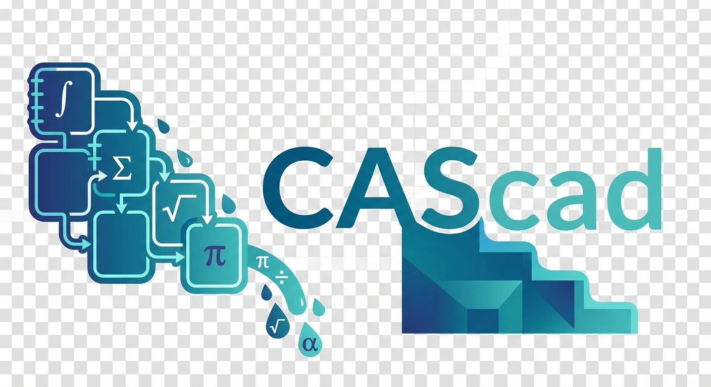

<p align="center">
  
</p>

# CAScad — Computer Algebra System Notebook

An interactive, browser-based computer algebra notebook with multi-kernel support and reactive cell evaluation.

**[Live Demo](https://s-celles.github.io/CAScad/)** (if deployed via GitHub Pages)

## Features

- **Multi-kernel support** — Switch between [Giac/Xcas](https://www-fourier.univ-grenoble-alpes.fr/~parisse/giac.html) (default) and [CortexJS Compute Engine](https://cortexjs.io/compute-engine/) via a toolbar selector
- **Reactive DAG execution** — Cells automatically re-evaluate when their dependencies change, powered by [Observable Runtime](https://github.com/observablehq/runtime)
- **Visual math input** — LaTeX-style editing with [MathLive](https://mathlive.io/) and a custom virtual keyboard (fractions, integrals, sums, products, Greek letters)
- **MathJSON-first pipeline** — Math cells use MathJSON internally: MathField -> MathJSON -> kernel, LaTeX used only for display
- **Interactive 2D plots** — `plot(sin(x))`, `plotfunc`, `plotparam`, `plotpolar`, `plotimplicit`, `plotfield`, `plotcontour`, `plotode`, `plotseq` rendered with [JSXGraph](https://jsxgraph.org/) (zoom, pan, coordinates)
- **3D surface plots** — `plotfunc(x^2+y^2,[x,y])` rendered with WebGL
- **Statistical charts** — `histogram`, `barplot`, `camembert`, `boxwhisker`, `scatterplot`
- **Geometry** — `circle`, `segment`, `point` and more
- **LaTeX output** — Results rendered with [KaTeX](https://katex.org/)
- **Internationalization** — 10 languages: English, French, Spanish, German, Greek, Arabic (RTL), Hindi, Russian, Chinese, Japanese
- **Export/Import** — Save and reload notebooks as JSON (v5 format with kernel field, backward-compatible with v1–v4)
- **Reactive/Manual toggle** — Switch between automatic cascade and manual cell-by-cell execution
- **Command discovery** — `search_commands()`, `list_categories()`, `suggest_commands()` and more for exploring available functions

## Kernels

| Kernel | Description | Status |
|--------|-------------|--------|
| **Giac/Xcas** | Full-featured CAS — algebra, calculus, plots, linear algebra, programming | Default, requires `giac.js` |
| **CortexJS Compute Engine** | Symbolic computation — simplify, factor, differentiate, integrate | Loaded from CDN |

The active kernel is selected via the toolbar dropdown. The choice is persisted in `localStorage` and saved in notebook files (v5 format).

## Getting Started

1. Download [giac.js](https://www-fourier.univ-grenoble-alpes.fr/~parisse/giacjs.tar.gz) and place it in the project root
2. Serve the directory with any static HTTP server:
   ```bash
   npx serve .
   # or
   python3 -m http.server
   ```
3. Open `http://localhost:3000` (or `:8000`) in a modern browser
4. Wait for "Giac ready" status, then start computing

> **Note**: A local HTTP server is required because the project uses ES module imports. Opening `index.html` directly via `file://` will not work.

## Project Structure

```
index.html              HTML shell (header, toolbar, notebook container)
css/
  notebook.css          All styles
js/
  kernel-registry.js    Multi-kernel abstraction and registry
  kernel-giac.js        Giac/Xcas kernel adapter
  kernel-compute-engine.js  CortexJS Compute Engine kernel adapter
  i18n.js               Internationalization (10 locales)
  giac-init.js          CortexJS Compute Engine + Giac initialization
  mathjson-xcas.js      MathJSON -> Xcas string converter
  state.js              Shared application state
  io.js                 Export/Import + utilities
  plot-rendering.js     2D/3D plot rendering (SVG, gr2d, JSXGraph, WebGL)
  reactive-dag.js       Reactive DAG with Observable Runtime
  cells.js              Cell management, debug panel, mode switching
  execution.js          Cell execution engine
  command-discovery.js  Command search, browse, and suggest functions
  actions.js            Global actions (run all, delete, move)
  boot.js               Startup sequence, virtual keyboard config, demo cells
assets/
  CAScad.jpeg           Visual identity / logo
examples/
  giac-js/              Example notebooks for Giac/Xcas kernel
  compute-engine/       Example notebooks for CortexJS Compute Engine
giac.js                 Giac/Xcas engine (asm.js, not included — download separately)
```

## Examples

The notebook comes pre-loaded with demo cells covering:

| Category | Examples |
|----------|----------|
| **Reactive chain** | `a := 5`, `a^2`, `b := a + 3` |
| **Calculus** | `\frac{x^4-1}{x^2+1}`, `\int \frac{1}{x^2+1} dx`, `\frac{d}{dx}(\sin(x) \cdot e^x)`, `\lim_{x\to 0} \frac{\sin(x)}{x}` |
| **Finite sums/products** | `\sum_{k=1}^{n} k`, `\prod_{k=1}^{n} k`, `\sum_{k=1}^{10} k^2` |
| **Infinite series** | `\sum_{n=1}^{\infty} \frac{1}{n^2}` (Basel), `\sum_{n=0}^{\infty} \frac{(-1)^n}{2n+1}` (Leibniz) |
| **Algebra** | `solve(x^2 - 3*x + 2 = 0, x)`, `eigenvalues([[1,2],[3,4]])` |
| **2D plots** | `plot(sin(x))`, `plotfunc([sin(x),cos(x)],x)`, `plotimplicit(x^2+y^2-1,x,y)` |
| **3D plots** | `plotfunc(x^2+y^2,[x,y])`, `plotfunc(sin(x)*cos(y),[x,y])` |
| **Statistics** | `histogram(...)`, `barplot(...)`, `camembert(...)`, `boxwhisker(...)`, `scatterplot(...)` |
| **Geometry** | `circle(0,2); segment([0,0],[2,0]); point(1,1)` |

## P2P Transfer (Phone → PC)

Transfer a notebook from your phone to your PC without needing a webcam on the PC side. Uses WebRTC for direct browser-to-browser communication — notebook data never passes through any server.

### Prerequisites

- Two devices (phone + PC) with internet access
- Modern browser (Chrome 83+, Firefox 80+, Safari 15+, Edge 83+)
- Phone must have a camera for QR scanning

### How to Use

1. On the **PC**, click **📲 Receive from Phone** in the toolbar — a QR code appears
2. On the **phone**, click **📷 Scan QR** and scan the PC's QR code
3. Both devices show a **4-digit confirmation code** — verify they match
4. The notebook transfers automatically from phone to PC
5. Review and confirm to load the notebook

The connection uses PeerJS Cloud for signaling and Google STUN for NAT traversal. All notebook data travels over a DTLS-encrypted WebRTC data channel.

### Transfer Methods Comparison

| Method | PC Webcam | Internet | Size Limit | Speed |
|--------|-----------|----------|------------|-------|
| Static QR | No | No | ~2 KB | Instant |
| Animated QR (Fountain) | No | No | Unlimited | 5-30s |
| URL Sharing | No | Yes | ~2 KB | Instant |
| File Export/Import | No | No | Unlimited | Manual |
| **P2P Transfer** | **No** | **Yes** | **Unlimited** | **<10s** |

**When to use P2P Transfer**: You want to send a large notebook from phone to PC, the PC has no webcam, and both devices have internet access.

## Keyboard Shortcuts

| Shortcut | Action |
|----------|--------|
| `Shift+Enter` | Run current cell |
| `Ctrl+Enter` | Run current cell + add new cell |
| `Ctrl+Shift+Enter` | Run current cell only (no reactive cascade) |

## Technology Stack

- **Giac/Xcas** (asm.js) — Computer algebra engine (default kernel)
- **CortexJS Compute Engine** — Symbolic computation engine (alternative kernel)
- **MathLive** — Math input web component
- **KaTeX** — LaTeX rendering
- **JSXGraph** — Interactive 2D/3D plots
- **Observable Runtime** — Reactive dependency graph
- No build step, no bundler — pure browser ES2020+

## Related Projects

- [Giac/Xcas](https://www-fourier.univ-grenoble-alpes.fr/~parisse/giac.html) — Computer algebra system by Bernard Parisse
- [KaTeX](https://katex.org/) — Fast LaTeX math rendering for the web
- [JSXGraph](https://jsxgraph.org/) — Interactive geometry and function plotting in the browser
- [Observable Runtime](https://github.com/observablehq/runtime) — Reactive dataflow runtime for dependency graphs
- [MathLive](https://mathlive.io/) — Web component for math input editing
- [CortexJS Compute Engine](https://cortexjs.io/compute-engine/) — LaTeX/MathJSON parsing and symbolic computation

## Credits

- [Giac/Xcas](https://www-fourier.univ-grenoble-alpes.fr/~parisse/giac.html) by Bernard Parisse
- [MathLive](https://mathlive.io/) by Arno Gourdol
- Virtual keyboard layout inspired by [B. Parisse's math2d.html](https://www-fourier.univ-grenoble-alpes.fr/~parisse/test/math2d.html)

## License

GPL-3.0 — See [LICENSE.txt](LICENSE.txt)
